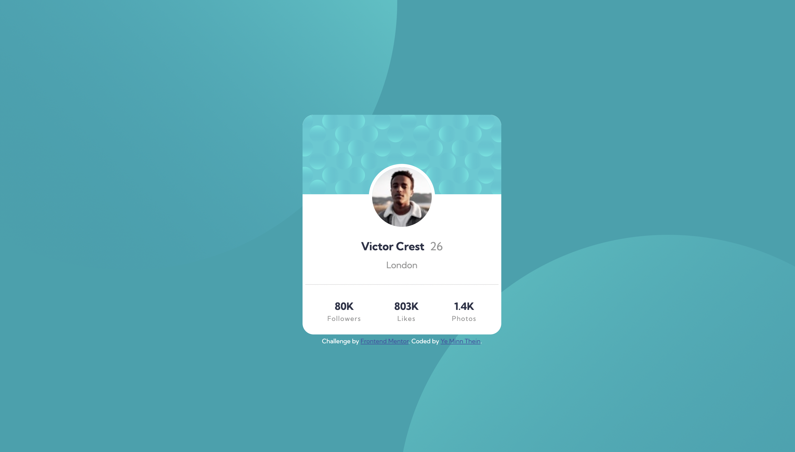

# Frontend Mentor - Profile card component solution

This is a solution to the [Profile card component challenge on Frontend Mentor](https://www.frontendmentor.io/challenges/profile-card-component-cfArpWshJ). Frontend Mentor challenges help you improve your coding skills by building realistic projects. 

## Table of contents

- [Overview](#overview)
  - [The challenge](#the-challenge)
  - [Screenshot](#screenshot)
  - [Links](#links)
- [My process](#my-process)
  - [Built with](#built-with)
  - [What I learned](#what-i-learned)
  - [Continued development](#continued-development)
  - [Useful resources](#useful-resources)
- [Author](#author)
- [Acknowledgments](#acknowledgments)

## Overview

A perfect project for newbies who are starting to build confidence with layouts!

### The challenge

- Build out the project to the designs provided

### Screenshot



### Links

- Solution URL: [GitHub Repo](https://github.com/ymt-github/project_pcc.git)
- Live Site URL: [GitHub Page](https://ymt-github.github.io/project_pcc/)

## My process

- Write HTML
- Write External CSS and linked with HTML file.
- Modify style with basic CSS and media-control.
- Arrange background images for both mobile and desktop.
- Check with design sample for both mobile and desktop.
- Push to GitHub

### Built with

- Semantic HTML5 markup
- CSS custom properties
- Flexbox
- Mobile-first workflow

### What I learned

```html
<h1>Some HTML code I'm proud of</h1>
```
```css
background-image: url(./images/bg-pattern-top.svg),
    url(./images/bg-pattern-bottom.svg);
    background-repeat: no-repeat, no-repeat;
    background-position: bottom 42vh right 45vw, top 45vh left 42vw
```

### Continued development

May be minor update.

### Useful resources

- None

## Author

- GitHub - [Ye Minn Thein](https://github.com/ymt-github?tab=repositories)
- Frontend Mentor - [@ymt-github](https://www.frontendmentor.io/profile/ymt-github)
- Twitter - [@ymt_tweet](https://twitter.com/ymt_tweet)

## Acknowledgments

Thank you very much <b>Frontend Mentor</b> for making this project as open-project.
